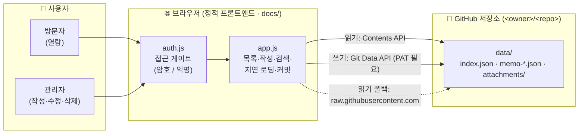
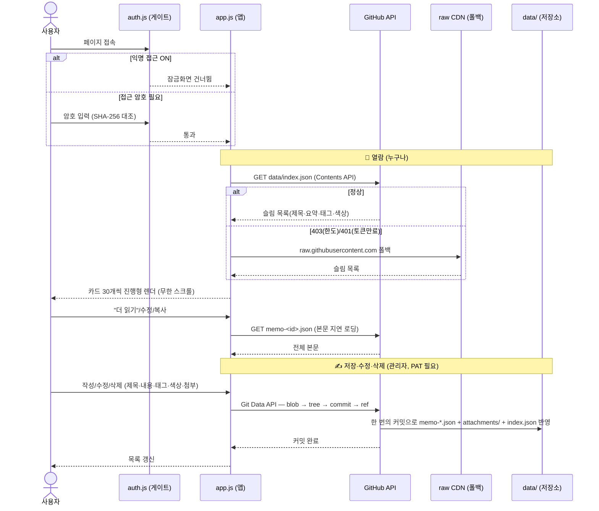

# 📢 My Memo

Git 저장소 기반의 **온라인 포스트잇/메모 홈페이지**입니다.
스티키 노트(포스트잇) 카드 UI로 메모를 열람하고, 새 메모(제목·내용·태그·색상·첨부파일)를
작성하면 **브라우저 자바스크립트가 GitHub API로 저장소의 `./data/` 폴더에 직접 Git 커밋**합니다.

> 서버(백엔드)가 필요 없으므로 **GitHub Pages 같은 정적 호스팅에서 그대로 동작**합니다.
> 예: `https://<사용자>.github.io/<저장소>/` · (선택) 로컬 `server.js` 자체 호스팅 모드도 지원합니다.

**주요 기능**: 작성 · 수정 · 복사 · 삭제 · 메모별 색상 선택 · 파일 첨부 · 태그 ·
**검색/태그 필터** · 접근 암호(웹에서 변경) · **익명 접근 토글** ·
대용량 대비(**진행형 렌더 · 슬림 인덱스 · 본문 지연 로딩**).

## 🧩 한눈에 보기

**서버(백엔드) 없이** 브라우저 자바스크립트 하나가 GitHub API를 직접 호출해 저장소에
**읽고 · 커밋**하는 구조입니다. 정적 호스팅(GitHub Pages)에 올리면 그대로 동작합니다.



| 구성 요소 (경로) | 역할 | 설명 |
|---|---|---|
| 🔐 [`docs/js/auth.js`](docs/js/auth.js) | 접근 게이트 | 접근 암호(`PASS_HASH`, SHA-256) 확인 · 익명 접근(`ALLOW_ANON`) 토글 |
| ⚙️ [`docs/js/app.js`](docs/js/app.js) | 앱 로직 | 목록 읽기·작성·수정·삭제, 검색/태그 필터, 진행형 렌더, 본문 지연 로딩, GitHub 커밋 |
| 🖼️ [`docs/index.html`](docs/index.html) · [`config.js`](docs/config.js) | 화면·설정 | 잠금화면 + 카드 UI + 모달 · 런타임 설정(owner/repo/branch, **토큰은 비움**) |
| 🗂️ [`data/`](data/) | 데이터 저장소 | `index.json`(슬림 목록) · `memo-<id>.json`(본문 1건=1파일) · `attachments/`(첨부) |
| 🖥️ [`server.js`](server.js) | (선택) 로컬 서버 | 토큰 없이 로컬 git으로 커밋하는 자체 호스팅 모드 (JSON API + 정적 서빙) |

## 🔄 데이터 흐름 (Data Flow)

**열람**은 누구나(토큰 불필요), **저장·수정·삭제**는 관리자만(쓰기 토큰 필요)입니다.
아래는 페이지 접속부터 메모 커밋까지의 전체 흐름입니다.



> 💡 **핵심 원칙:** _읽기는 누구나 · 쓰기는 관리자 토큰으로._ 토큰(PAT)은 배포물에 굽지 않고
> **관리자 브라우저의 localStorage에만** 저장되어, 공개 노출·자동 폐기 위험이 없습니다.

## 동작 방식

- **접근 (잠금화면)** — 페이지에 들어가려면 암호를 입력합니다. **익명 접근**이 켜져 있으면
  잠금화면 없이 누구나 열람합니다. (가벼운 차단, 아래 참고)
- **열람 (누구나)** — GitHub Contents API로 `./data/index.json`(제목·요약·태그·색상 등
  **경량 목록**)을 읽어 카드로 표시합니다. 카드는 **30개씩 점진적으로 렌더**되고 스크롤 시
  이어서 로드됩니다(무한 스크롤). 각 메모의 **전체 본문**은 "더 읽기"·복사·수정 시에만
  `memo-<id>.json`을 **지연 로딩**합니다. 공개 저장소면 토큰 없이도 열람되며(익명 시간당 60회),
  API 한도(403)·**토큰 만료/폐기(401)** 시 `raw.githubusercontent.com`으로 폴백합니다.
- **저장/수정/삭제 (관리자)** — GitHub Git Data API(blob → tree → commit → ref)로
  `./data/`에 파일을 만들고 **한 번의 커밋**으로 반영합니다. **쓰기 권한 토큰(PAT)** 이
  필요하며, **관리자가 ⚙ 관리자 설정에서 직접 입력**합니다(그 브라우저 localStorage 에만 저장,
  배포물에는 실리지 않음).

```
잠금화면(암호)  ▶  브라우저(JS)  ──GitHub API(REST)──▶  github.com/<owner>/<repo>  ──▶  ./data/ 에 커밋
                                └ 읽기 폴백: raw.githubusercontent.com
```

## 화면 · UX

- **포스트잇 카드** — 7색 파스텔 팔레트, 살짝 기울어진 종이 + 상단 테이프, 호버 시 반듯하게
  펴지며 떠오릅니다. 색은 작성/수정 시 **직접 선택**하거나 **자동**(메모 id 해시로 배정)으로 둘 수 있습니다.
- **검색 + 태그 필터** — 목록 상단 검색창(제목·요약·태그, 대소문자 무시)과 태그 칩(빈도순·개수 표시).
  태그는 여러 개 선택 시 **모두 포함(AND)** 하는 메모만 보여 줍니다.
- **진행형 렌더 / 무한 스크롤** — 메모가 많아도 초기 30개만 그리고 스크롤·"더 보기"로 이어 렌더합니다.

## 구조

```
mymemo/
├─ docs/                     # 정적 프론트엔드 (GitHub Pages 소스)
│  ├─ index.html             #   잠금화면 + 검색/필터 + 메모 목록 + 작성/관리자 모달
│  ├─ config.js              #   런타임 설정 (배포 시 owner/repo/branch만 주입, 토큰은 비움)
│  ├─ css/style.css
│  └─ js/
│     ├─ auth.js             #   접근 암호(PASS_HASH) + 익명 접근(ALLOW_ANON) 게이트
│     └─ app.js              #   읽기/커밋, 목록·작성·수정·삭제, 지연 로딩, 검색/필터, 진행형 렌더
├─ data/                     # 메모 저장소 (여기에 커밋됩니다)
│  ├─ index.json             #   경량 목록(제목·요약 snippet·태그·색상 등) — 전체 본문은 없음
│  ├─ memo-<id>.json         #   메모 1건 = 파일 1개 (전체 본문 포함)
│  └─ attachments/           #   첨부파일
├─ .github/workflows/
│  └─ deploy.yml             # Pages(Actions) 배포 (토큰 미주입 · 배포 단계 자동 재시도)
├─ server.js                 # (선택) 로컬 자체 호스팅용 Node 서버 (JSON API + 정적 서빙)
└─ package.json
```

> **슬림 인덱스**: `index.json`에는 본문 전체 대신 **요약(snippet, 약 180자) + `more` 플래그**만
> 담겨 초기 다운로드가 가볍습니다. 전체 본문이 필요할 때만 `memo-<id>.json`을 개별 로딩합니다.
> (기존 GitHub 모드 index의 옛 항목은 재저장 전까지 전체 본문을 유지하며 점진 적용됩니다.)

## 접근 암호 (가벼운 차단)

홈페이지에 들어가려면 잠금화면에서 암호를 입력해야 합니다.
기본 암호는 **배포 담당자에게 문의**하세요. (공개 저장소 특성상 실제 암호는 문서에 적지 않습니다. **운영 시 반드시 변경하세요.**)

암호를 바꾸는 방법은 두 가지입니다.

- **웹에서 (권장)** — ⚙ 관리자 설정 → **🔑 접근 암호 변경**에 현재/새 암호를 입력하면,
  새 암호의 **SHA-256 해시만** `docs/js/auth.js`에 커밋됩니다(평문은 저장 안 함).
  쓰기 토큰(또는 서버 연결)이 필요하며, **배포 재빌드 후(수 분) 모든 기기**에 적용됩니다.
- **직접 편집** — `docs/js/auth.js`의 `PASS_HASH`를 새 암호의 SHA-256 해시로 교체:

  ```bash
  printf '%s' '새암호' | sha256sum   # 출력된 해시를 PASS_HASH에 붙여넣기
  ```

### 익명 접근 (암호 없이 누구나 열람)

가끔 누구나 열람할 수 있게 공개하려면 ⚙ 관리자 설정 → **👀 익명 접근**에서
**"익명 접근 (로그인 접근 암호 불필요) 허용"** 을 켜고 **적용 (Git 커밋)** 을 누르세요.

- 켜면 `docs/js/auth.js`의 `ALLOW_ANON` 플래그가 `true`로 커밋되어, **잠금화면 없이 누구나** 열람합니다.
- 저장·수정·삭제는 여전히 쓰기 토큰이 필요하므로, 익명 방문자는 **열람만** 가능합니다.
- 변경에는 쓰기 토큰(또는 서버 연결)이 필요하며, **배포 재빌드 후(수 분) 모든 방문자**에게 적용됩니다.
- 다시 끄면 잠금화면(접근 암호)이 복원됩니다.

> ⚠️ 정적 사이트라 브라우저에서만 검사하는 **가벼운 차단**입니다. 저장소가 공개면
> 데이터/설정 파일에 URL로 직접 접근할 수 있으니 기밀 보호용이 아닙니다.

## 토큰(PAT)으로 저장 활성화

저장·수정·삭제는 저장소에 커밋하므로 **쓰기 권한 토큰(fine-grained PAT)** 이 필요합니다. (열람만 하면 불필요)

발급: GitHub → **Settings → Developer settings → Fine-grained personal access tokens**
→ Repository access: `mymemo` → **Repository permissions → Contents: Read and write**

### 브라우저 ⚙ 관리자 설정에 직접 입력 (유일하게 권장되는 방식)

정적 호스팅(GitHub Pages)만으로도 쓰기가 됩니다. **관리자 본인 브라우저에만** 토큰을 두면 됩니다.

1. `https://<사용자>.github.io/<저장소>/` 접속 → 잠금화면 암호 입력
2. 우측 상단 **⚙ 관리자 설정 → GitHub 토큰**에 위에서 만든 `github_pat_...` 붙여넣기 → **저장**
3. 이제 그 브라우저에서 저장/수정/삭제 버튼이 활성화됩니다.

토큰은 **그 브라우저의 localStorage에만** 저장되고, 배포된 `config.js`에는 들어가지 않습니다.
따라서 공개 노출·자동 폐기 위험이 없습니다. Owner/Repo/Branch는 접속 URL에서 자동 인식되며
필요하면 관리자 설정에서 바꿀 수 있습니다. (쓰는 브라우저마다 한 번씩 입력하면 됩니다.)

> 🔴 **하지 말 것 — 토큰을 배포물에 굽지 마세요.**
> `docs/config.js`(또는 repo Secret 주입)에 토큰을 넣으면 배포 후
> `https://<user>.github.io/<repo>/config.js` 로 **누구나 내려받을 수 있고**,
> GitHub 보안 스캐닝이 이를 감지해 **토큰을 자동 폐기(401)** 합니다.
> 그래서 [.github/workflows/deploy.yml](.github/workflows/deploy.yml)은 owner/repo/branch만
> 주입하고 **token은 항상 빈 값**으로 배포합니다. (이전에 쓰던 `MYMEMO_WRITE_TOKEN` Secret은
> 더 이상 사용하지 않으므로 저장소 설정에서 삭제해도 됩니다.)

## 사용법

- 오른쪽 아래 **+** 버튼 → 제목·내용·태그·**색상**·파일첨부 입력 → **저장 (Git 커밋)**
  - 저장 시 `memo-<id>.json` + 첨부파일 + `index.json`이 **하나의 커밋**으로 반영됩니다.
  - **색상**: 스와치에서 7색 중 고르거나 **자동**(메모마다 색 자동 배정)을 선택합니다.
- 카드의 **수정** 버튼 → 기존 제목·내용·태그·색상·첨부를 불러와 편집 → 다시 커밋 (`memo: edit ...`)
  - 기존 첨부는 체크 해제하면 삭제되고, 새 파일을 추가할 수 있습니다. 수정된 메모는 `(수정됨)`으로 표시됩니다.
- 카드의 **삭제** 버튼 → 해당 파일 삭제 커밋 · **복사** 버튼 → 제목+본문을 클립보드로 복사
- 본문이 길면 카드에 **"더 읽기"** 가 표시되며, 누르면 전체 본문을 불러옵니다.
- 상단 **검색창/태그 칩**으로 원하는 메모를 빠르게 거를 수 있습니다.
- 토큰이 없으면 **읽기 전용 모드**로 열람만 됩니다.

## (선택) 로컬 서버 모드

토큰 대신 로컬 PC에서 직접 git 커밋하고 싶다면 `server.js`를 쓸 수 있습니다. (Node 코어만 사용, 의존성 없음)

```bash
node server.js                 # http://localhost:9999
PORT=8080 node server.js       # 포트 지정
GIT_PUSH=true node server.js   # 커밋 후 원격으로 push까지
```

그 후 **⚙ 관리자 설정 → 저장 방식: 로컬 서버**를 선택하고 서버 주소를 입력하세요
(서버가 서빙하는 `http://localhost:9999/`로 접속하면 주소를 비워 둬도 됩니다).
이 경우 `./data/`에 파일을 쓰고 로컬 git으로 커밋합니다.
(정적 GitHub Pages에는 서버가 없으므로 이 모드는 동작하지 않습니다.)

### 서버 API 요약

| 메서드 | 경로 | 설명 |
|--------|------|------|
| GET | `/api/health` | 상태·저장소·브랜치 확인 |
| GET | `/api/memos` | 경량 목록(요약) 반환 |
| POST | `/api/memos` | 새 메모 저장 + 커밋 |
| PUT | `/api/memos/:id` | 메모 수정 + 커밋 |
| DELETE | `/api/memos/:id` | 메모 삭제 + 커밋 |
| PUT | `/api/password` | 접근 암호 해시 변경(auth.js 커밋) |
| PUT | `/api/anon` | 익명 접근 토글(auth.js 커밋) |
| GET | `/data/...` | 메모 전체 본문·첨부 정적 서빙 |

## 문제 해결

- **저장 버튼이 안 보이고 읽기 전용임**
  → 이 브라우저에 토큰이 없습니다. **⚙ 관리자 설정 → GitHub 토큰**에 PAT를 입력·저장하세요.
  (토큰은 쓰는 브라우저마다 한 번씩 입력해야 합니다.)
- **"GitHub 토큰이 유효하지 않습니다 (401)"**
  → 토큰이 만료·폐기됐습니다. 특히 **토큰을 공개 `config.js`/배포물에 넣으면** GitHub 보안
  스캐닝이 자동 폐기합니다. 열람은 raw 폴백으로 유지되며, 저장하려면 **새 토큰을 ⚙ 관리자 설정에
  직접 입력**하세요. (절대 배포물에 굽지 마세요.)
- **새 기능/디자인이 사이트에 안 보임**
  → 배포가 갱신됐는지 확인하고(아래), 브라우저에서 **`Ctrl+Shift+R`(강력 새로고침)** 을 한 번 하세요.
  index.html·js·css 같은 정적 파일은 브라우저·CDN이 잠시 캐시합니다. (메모 데이터는 즉시 반영됩니다.)
- **GitHub Pages 배포가 실패함 ("Deployment failed, try again later.")**
  → GitHub 측 일시 오류입니다. 워크플로가 **최대 3회 자동 재시도**하며, 그래도 실패하면
  저장소 **Actions 탭 → 실패한 Deploy → Re-run jobs** 로 재실행하세요.
- **메모가 방금 저장했는데 다른 기기에서 안 보임**
  → 읽기 폴백(raw CDN)은 최대 몇 분 캐시될 수 있습니다. 잠시 후 새로고침하세요.
